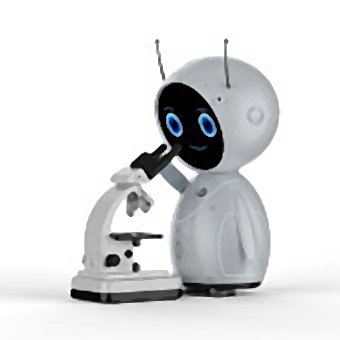

# AutoScanJ
**A suite of ImageJ and Micro-Manager scripts to perform intelligent imaging.**

AutoScanJ is a suite of ImageJ scripts enabling to image targets of interest by automatically driving a motorized microscope (controlled by Micro-Manager or Leica LASAF with Matrix/CAM modules) at the corresponding locations. For live samples, the software can detect biological events from their onset and sequentially image them at high resolution, an action that would be impractical by user operation. For fixed samples, the software can dramatically reduce the amount of data acquired in situations where statistically few objects of interest are observed per field of view. 

The target detection function can be simply customized in ImageJ macro language and AutoScanJ can run directly on the microscope workstation, or on a dedicated image processing workstation connected to the same local network as the microscope workstation. In this latter case, the interaction is implemented as network socket-based messages and the images are shared by network folder (instead of a local folder). 

The concept of intelligent microscopy and sample applications corresponding to the different possible scenarios (fixed/live sample and tiled/block scans) is described in detail in the article **AutoScanJ: A Suite of ImageJ Scripts for Intelligent Microscopy**.

AutoScanJ Software and Hardware Components: https://bit.ly/3nSfFAA 
Manual to write custom  target detection functions: https://bit.ly/2LJzLPN 
Software documentation for use with Micro-Manager:  https://bit.ly/2SyWcHS 
Software documentation for use with Leica LAS AF:   https://bit.ly/2GEhu4a 

Don't have a compatible microscope at hand but still want to test the macros?

Download test data here: https://bit.ly/3d25TYt

**Usage of the test data**

For fixed experiments:
- Unzip the data that you want to test to an empty folder
- Run the corresponding ImageJ macro and select the folder you unzipped the data to as experiment folder
- Untick "Perform primary scan" and "Send CAM scripts" so that the macro does not attempt to re-acquire primary scan image by controlling the microscope
- Select the Automatic pre-analysis function corresponding to the dataset you downloaded (**Glomerulus_detector** or **Metaphase_detector**) 
- Leave all other options to there default

You should see the primary scan map with the detected targets and the targets should be montaged in the QuickView window. It is not possible to go further with this demo and acquire secondary scan images since the microscope is not connected. Pressing OK twice in the next dialog boxes will bring the expected message "The images from the CAM list cannot be found" since no secondary scan images will be acquired. 

For live experiments:
- Unzip the data that you want to test to an empty folder
- Create an **empty** folder (required to empty it before each run)
- Set the variable **OfflineFilesPath** in the corresponding IJ macro to the path of the folder you unzipped the data to
- Run the ImageJ macro and select the empty folder as experiment folder
- Untick "Send CAM scripts" so that the macro does not attempt to control the microscope
